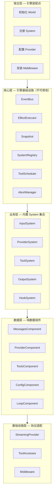
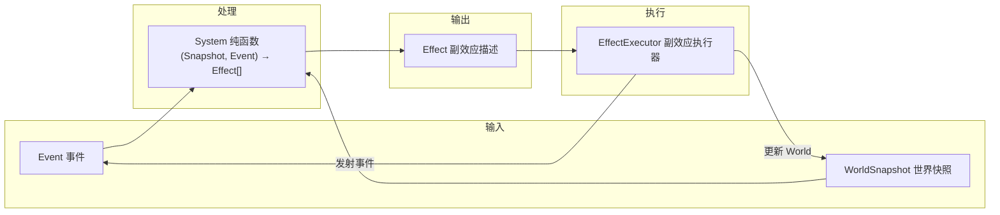
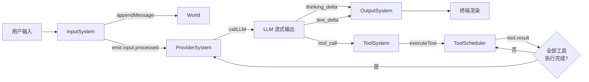
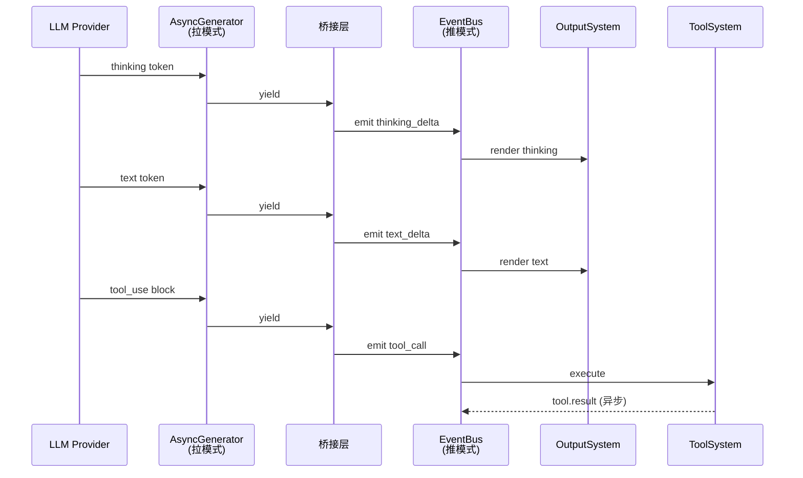
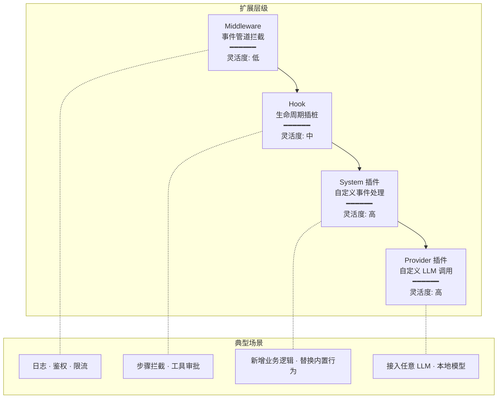

# Alice — 设计文档

## 1. 概述

Alice 是一个数据驱动、无状态、流式并发、高度可定制的 CLI AI Agent 引擎。

它面向需要与大型语言模型交互并编排工具调用的 CLI 应用场景，提供一套以纯函数 System、Effect 副效应描述、事件驱动为核心的架构框架。Alice 不绑定任何特定 LLM 提供商或工具集，引擎提供骨架和契约，所有扩展点可替换和组合。

## 2. 设计哲学

### 数据驱动

World 是系统中唯一的真相源（Single Source of Truth）。所有系统行为由当前 World 中的数据状态和外部到达的事件共同决定，不存在隐式状态或记忆。数据的结构决定行为，而非行为隐式改变数据。

### 无状态

System 是纯函数，接受一份世界快照和一个事件，返回一组副效应描述。System 不持有可变内部状态，不直接修改数据，不产生实际副作用。系统的可理解性、可测试性和可推理能力由此得到根本保障。

### 流式优先

LLM 输出本质上是流式的，工具执行也包含流式结果。Alice 从底层设计上支持流式并发：LLM 令牌逐块到达时即可触发渲染和工具调度，无需等待完整响应。流式不是附加能力，而是数据流动的默认形态。

### 可定制

核心引擎只提供最小可行骨架。中间件、生命周期钩子、自定义 System、自定义 Provider 四个层次的扩展点覆盖从浅到深的定制需求。用户可以在任意层次插入自己的逻辑，而不需要修改引擎本身。

## 3. 框架架构

### 3.1 分层模型

Alice 采用五层架构，自上而下依次是：

**宿主层** 是引擎的装配点。用户在此初始化 World、注册 System、配置 Provider、安装 Middleware、启动引擎运行循环。宿主层决定引擎的组成和行为边界。

**核心层** 是引擎的基础设施，用户不可修改。包含 EventBus（事件路由）、EffectExecutor（副效应调度执行）、Snapshot 机制（世界快照创建）、SystemRegistry（系统注册与管理）、ToolScheduler（工具执行调度）、AbortManager（取消与超时控制）。核心层提供运行时骨架。

**业务层** 是引擎内置的 System 集合。InputSystem 处理用户输入，ProviderSystem 驱动 LLM 调用，ToolSystem 编排工具执行，OutputSystem 管理输出渲染，HookSystem 执行生命周期钩子。这些 System 本身也可以被用户替换或扩展。

**数据层** 是 World 中的组件存储，只包含数据，不包含行为。MessagesComponent、ProviderComponent、ToolsComponent、ConfigComponent、LoopComponent 等组件以无行为的数据容器形式存在，由 System 通过 Effect 间接操作。

**基础设施层** 包含协议适配和扩展机制。StreamingProvider 抽象定义了与 LLM 的通信协议，ToolAccesses 管理工具注册与调用，Middleware 管道在事件流中插入拦截逻辑。

### 3.2 核心抽象

**System** 是 Alice 中的基本处理单元。它是一个纯函数，接收世界快照和事件，返回一组 Effect。System 不持有状态、不直接修改 World、不产生副作用、是幂等的。多个 System 通过事件类型路由各自处理自己关心的事件。

**Effect** 是副效应的描述，不是副效应本身。Effect 由核心层的 EffectExecutor 统一解释和执行。共有七种 Effect 类型：callLLM（发起 LLM 调用）、executeTool（执行工具）、appendMessage（追加消息到对话）、updateComponent（更新组件数据）、emit（向 EventBus 发出新事件）、render（触发输出渲染）、abort（终止当前步骤）。将副效应描述化使得执行可追踪、可拦截、可中断。

**Event** 是系统中所有交互的唯一媒介。共分四类：输入事件（来自用户或文件）、LLM 流事件（令牌增量、流结束、错误）、工具事件（工具调用请求、结果返回、错误）、系统事件（步骤开始/结束、生命周期钩子触发）。事件通过 EventBus 分发给所有注册的 System。

### 3.3 数据流

Alice 的主流程构成一个闭环。用户输入到达 InputSystem 后转换为事件，ProviderSystem 接收事件并驱动 LLM 调用，LLM 流式输出通过回调接口实时转换为流事件：输出令牌触发 OutputSystem 逐块渲染，工具调用指令触发 ToolSystem 执行工具。工具执行结果作为新事件注入 EventBus，触发 ProviderSystem 进行新一轮 LLM 调用。如此反复，直到满足终止条件。

整个过程在单一数据流闭环内完成，每一轮迭代由世界快照和事件驱动，不依赖外部循环控制。

### 3.4 并发模型

Alice 基于 Node.js 单线程事件循环实现异步并发。所有 I/O 操作（LLM 调用、工具执行、文件读写）以异步任务形式调度，不阻塞事件循环。

ToolScheduler 实现读写冲突检测：多个只读工具可以并发执行，涉及写操作的工具之间互斥。这既保证了工具执行的效率，也避免了数据竞争。

引擎采用混合事件模型。LLM 流式输出通过 AsyncGenerator 实现逐个数据块的拉取，离散事件（步骤边界、工具结果、生命周期点）通过 EventBus 发布订阅。两者之间由桥接层负责转换。

### 3.5 扩展机制

Alice 提供四级扩展，灵活度从低到高递增：

- **Middleware** 工作在事件管道层面，可以拦截、修改、延迟或丢弃经过 EventBus 的事件。适合横切关注点，如日志、鉴权、限流。
- **Hook** 是预定义的生命周期插桩点，包括 beforeStep、afterStep、beforeToolCall、afterToolCall、shouldContinue。用户通过注册回调函数在这些点注入逻辑，无需理解 System 内部机制。
- **System 插件** 允许用户编写自定义事件处理逻辑。通过实现 System 接口并将其注册到引擎，用户可以处理任意自定义事件类型或覆盖内置 System 的行为。
- **Provider 插件** 是最高灵活度的扩展方式。用户通过实现 StreamingProvider 接口接入任意 LLM 提供商或本地模型，引擎通过该接口与模型通信，不关心具体实现。

### 3.6 无状态保证

| 层面 | 保证方式 |
| --- | --- |
| World 数据 | 数据仅存在于 World 的组件存储中，所有修改通过 Effect 描述，由 EffectExecutor 批量应用 |
| System 实例 | System 是纯函数，不持有实例字段或闭包状态，每次调用从世界快照读取所需数据 |
| 控制流 | 每次迭代从世界快照开始，事件处理不依赖上一次调用的遗留状态 |
| 工具执行 | 工具结果作为事件返回，不通过共享可变状态传递 |
| 副效应 | 副效应被抽象为 Effect 描述，由 EffectExecutor 统一执行，可跟踪、可重试、可回滚 |

## 4. 设计决策

**为什么选 EventBus + Effect 而不是传统状态机**

状态机将状态转移逻辑固化在转移图中，适合状态少、转移路径明确的场景。Alice 面对的是 LLM 交互中高度不确定的控制流——每次模型输出可能触发任意数量的工具调用，工具结果又可能改变后续决策路径。EventBus 加 Effect 的模式将事件分发与副效应执行解耦，系统的行为由数据的当前状态和事件内容动态决定，不需要预定义所有可能的转移路径。

**为什么 System 是纯函数**

纯函数带来确定性和可组合性。相同的世界快照和事件输入永远产生相同的 Effect 输出。这使得 System 可以独立测试、独立推理，不会因为隐式状态或副效应相互干扰。纯函数的返回值是 Effect 而非直接操作，这意味着副效应可以被延迟执行、批量执行、甚至跳过执行。

**为什么采用混合事件模型**

LLM 流是顺序的生产者-消费者关系，每个令牌依次产生，用 AsyncGenerator 表达自然且高效。而系统级的离散事件（步骤边界、工具结果、生命周期钩子）是多对多的发布订阅关系，适合 EventBus。混合模型让两种数据流各自使用最合适的通信原语，桥接层负责在两者之间转换。

**为什么单线程异步**

Node.js 的单线程事件循环消除了大多数并发编程中的竞态条件和锁问题。对于 Alice 这种以 I/O 为主的引擎，单线程异步模型在保持编程模型简洁的同时，通过异步 I/O 提供了足够的并发吞吐能力。工具执行的读-写冲突检测在单线程中实现为简单的任务队列即可，无需复杂的锁机制。
